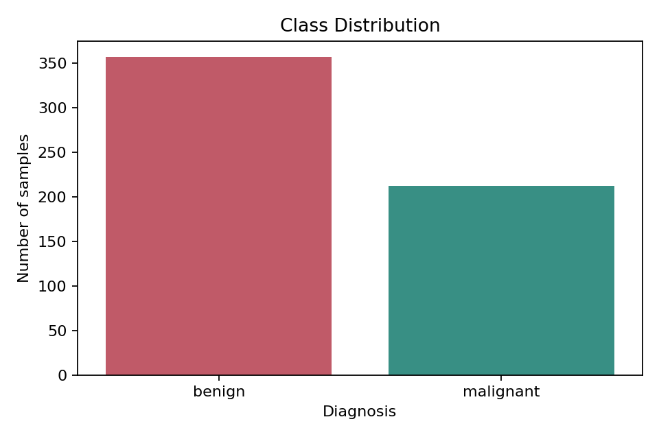
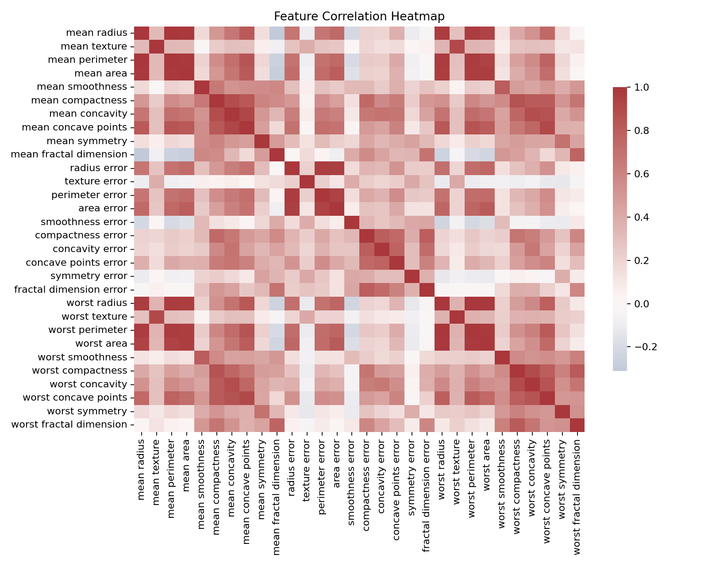
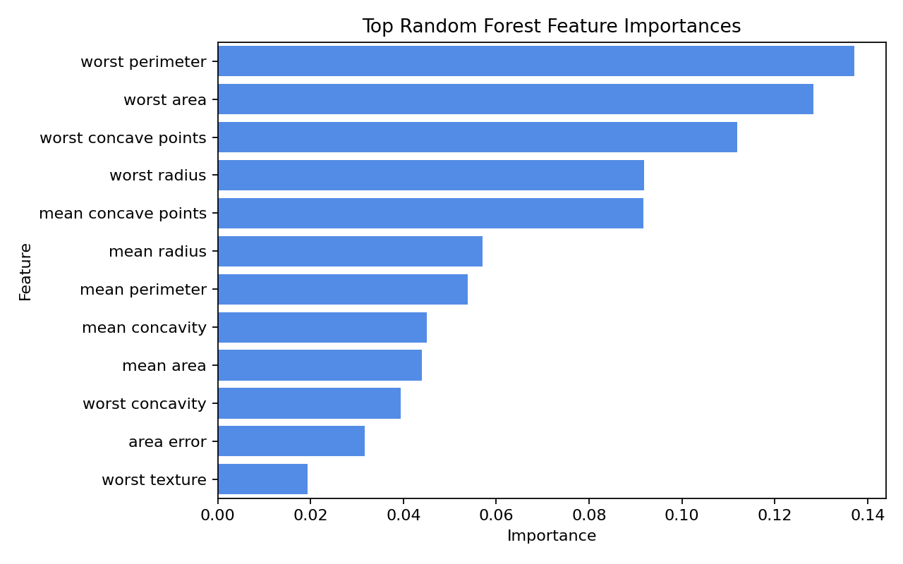
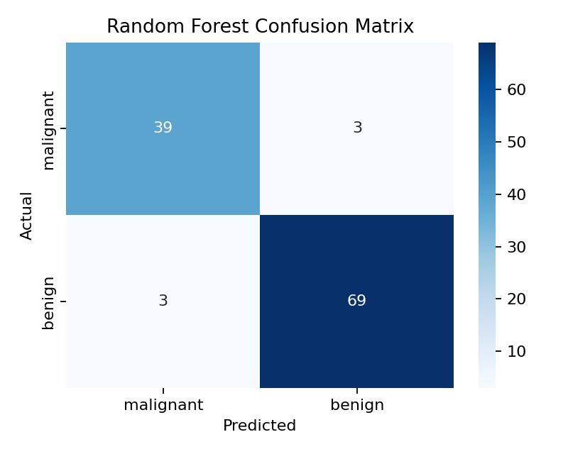
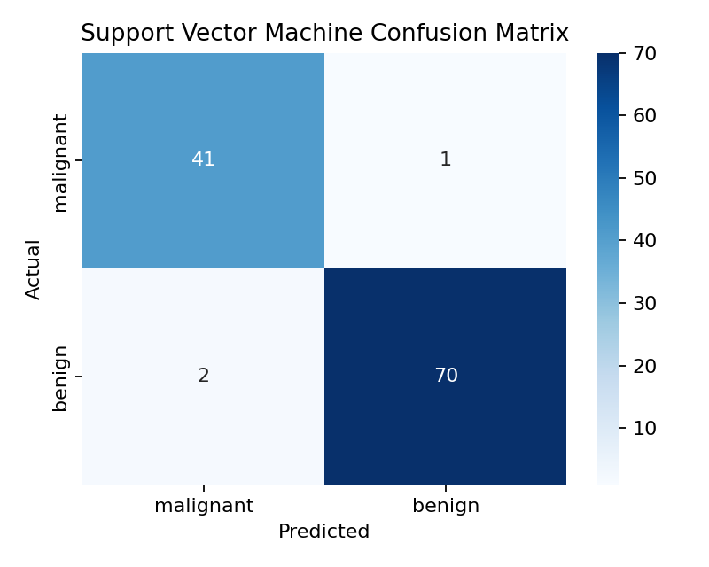
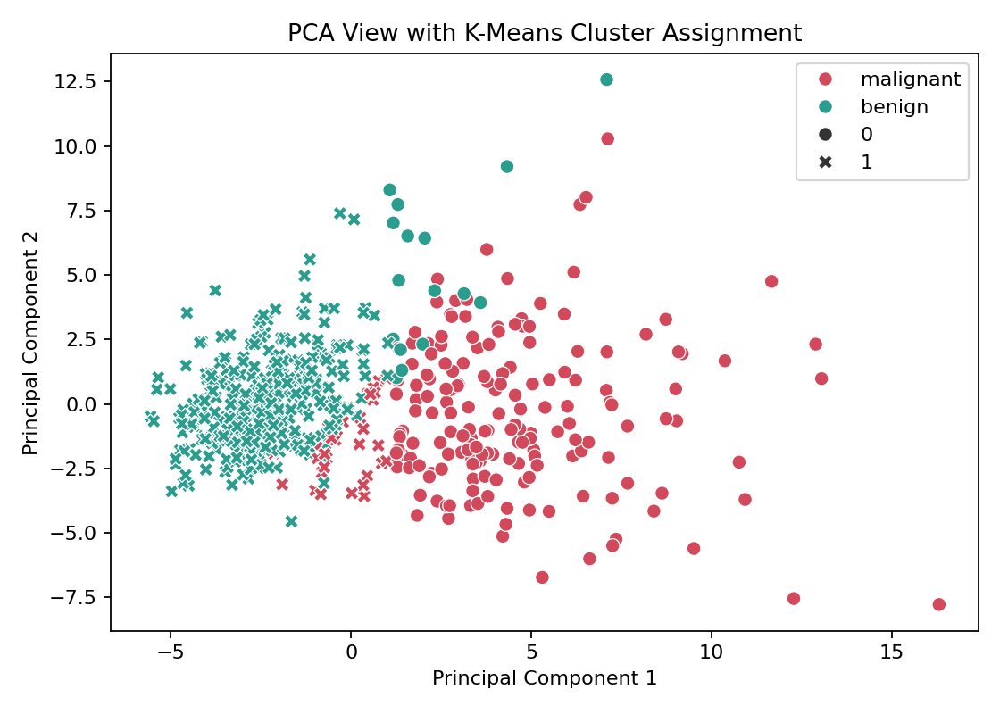

# AIML Assignment 3 Mini Project Report

## Title
Breast Cancer Diagnosis Prediction using Machine Learning

## Problem Statement
The objective of this project is to build a complete machine learning solution that predicts whether a breast tumor sample is **malignant** or **benign** using diagnostic measurements computed from digitized cell nuclei images.

## Dataset
- Source: UCI Machine Learning Repository, loaded through sklearn.datasets.load_breast_cancer
- Dataset size: 569 rows and 30 input features
- Target variable: diagnosis class, where `0 = malignant` and `1 = benign`
- Class distribution: malignant = 212, benign = 357
- Missing values found during cleaning: 0

## Real-World Significance
Early and accurate cancer diagnosis helps doctors prioritize additional tests and treatment planning. A machine learning model can support clinical decision-making by identifying suspicious tumor measurements, while still requiring expert medical confirmation.

## Features and Target
The features include radius, texture, perimeter, area, smoothness, compactness, concavity, symmetry, and fractal dimension statistics. The target is the tumor diagnosis class.

## Data Preprocessing
- Checked missing values and duplicates.
- Used a stratified train-test split so both diagnosis classes are represented in training and testing data.
- Applied `StandardScaler` inside each model pipeline so distance-based and margin-based algorithms are trained on normalized measurements.
- Kept preprocessing inside `Pipeline` objects to avoid data leakage.

## Exploratory Data Analysis
- Class distribution shows the dataset is moderately imbalanced but still contains enough samples for both classes.
- The correlation heatmap shows strong relationships among radius, perimeter, and area measurements.
- The Random Forest importance chart indicates that concavity, perimeter, radius, and area measurements are highly informative for diagnosis.

## Algorithms Used
1. **Decision Tree**: Suitable because it is interpretable and can model non-linear decision boundaries.
2. **Random Forest**: Suitable because it combines many trees, reduces overfitting, and provides feature importance.
3. **Support Vector Machine**: Suitable for high-dimensional classification and effective decision boundaries after scaling.

## Performance Comparison
| Model | Accuracy | Precision | Recall | F1-score |
|---|---:|---:|---:|---:|
| Decision Tree | 0.9211 | 0.9116 | 0.9226 | 0.9164 |
| Random Forest | 0.9474 | 0.9435 | 0.9435 | 0.9435 |
| Support Vector Machine | 0.9737 | 0.9697 | 0.9742 | 0.9719 |

Best-performing model: **Support Vector Machine**

The best model performed well because it captured non-linear relationships among tumor measurements while reducing overfitting through its learning strategy.

## Confusion Matrices

## Advanced Concept: Clustering
To extend the supervised classification work, K-Means clustering was applied after reducing the scaled features to two principal components using PCA.

- Silhouette score: 0.5085
- Adjusted Rand Index against actual diagnosis labels: 0.6592
- PCA explained variance ratio: [0.4427, 0.1897]

This addition enhances the project by showing whether natural groupings in the data align with the known diagnosis labels.

## Machine Learning Toolkit
This project uses **Scikit-learn** for dataset loading, preprocessing, model training, evaluation metrics, PCA, K-Means clustering, and pipeline management. Scikit-learn is useful because it provides consistent APIs for multiple ML algorithms and helps avoid data leakage through pipelines.

## Top Random Forest Feature Importances
| Feature | Importance |
|---|---:|
| worst perimeter | 0.1371 |
| worst area | 0.1283 |
| worst concave points | 0.1120 |
| worst radius | 0.0918 |
| mean concave points | 0.0917 |
| mean radius | 0.0570 |
| mean perimeter | 0.0538 |
| mean concavity | 0.0450 |

## Implementation
The implementation includes:
- `src/train_model.py` for training, evaluation, artifact generation, and report generation.
- `src/app.py` for the local web server and prediction API.
- `static/index.html`, `static/styles.css`, and `static/app.js` for the frontend interface.
- `artifacts/model_bundle.joblib` for the saved best model and metadata.
- `artifacts/metrics.json` for model results.

## Reflection and Learning Outcome
This project helped demonstrate the complete machine learning workflow from problem definition to evaluation and deployment-style prediction. The main challenge was making the workflow usable for non-technical users, which was solved by adding a simple web interface. The key insight was that several nuclear cell measurements are strongly correlated and highly predictive of diagnosis.

## Practical Applications
The project can be used as a learning prototype for clinical decision-support systems, medical data analysis, and educational demonstrations of classification workflows. It is not a replacement for professional medical diagnosis.
